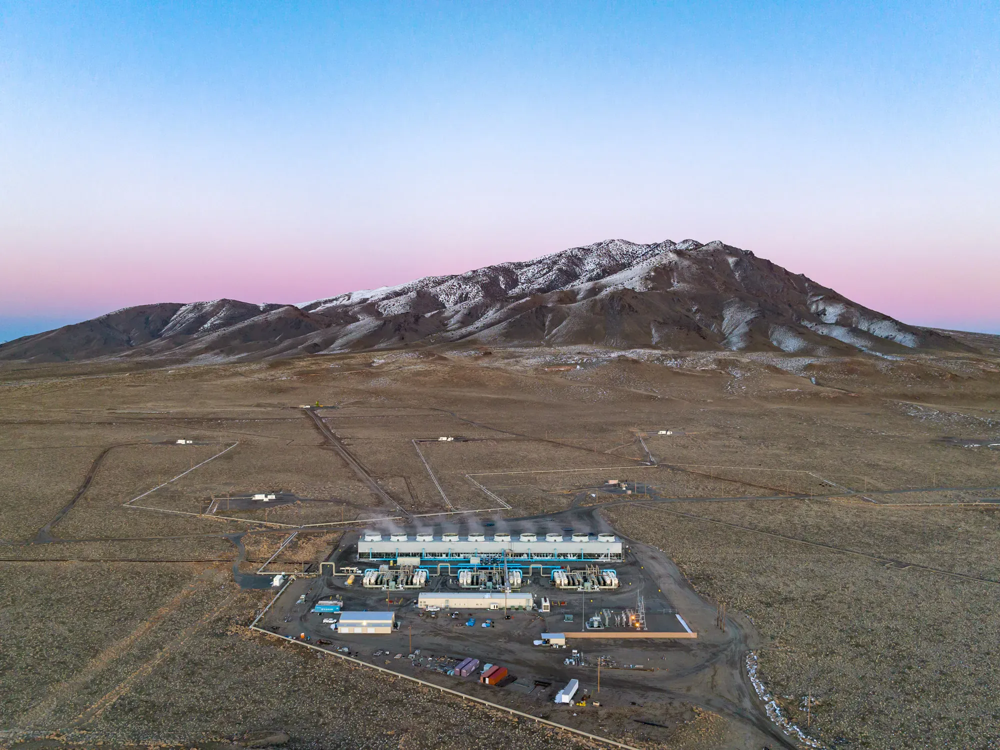

# 3. Ejemplos y buenas prácticas

Para entender mejor cómo se está aplicando la sostenibilidad en el sector TI, aquí van algunos ejemplos de empresas que están marcando la diferencia y acciones concretas que podemos tomar incluso desde nuestro día a día:

## 🌱 **Empresas tecnológicas que aplican medidas sostenibles:**

1. **Google:** Desde 2007 es neutra en carbono y desde 2017 funciona al 100% con energía renovable ☀️🌬️. Además, usa inteligencia artificial para optimizar la eficiencia energética de sus centros de datos, reduciendo el consumo hasta en un 30% 💡.

2. **Microsoft:** Se ha propuesto ser "carbono negativo" para 2030 🌿, es decir, eliminará más CO₂ del que emite. Han experimentado con centros de datos submarinos 🌊 para mejorar la eficiencia en la refrigeración.

3. **Amazon Web Services (AWS):** Está invirtiendo fuerte en energía renovable con la meta de operar al 100% con energía verde para 2025 🌍. También optimiza recursos para reducir el consumo energético en sus centros de datos.

## 🤝 **Acciones que pueden tomar los profesionales de TI para reducir el impacto ambiental:**

- **Escribir código eficiente** 💡: Un código optimizado reduce la carga de trabajo de los servidores, lo que baja el consumo de energía.
- **Apostar por el teletrabajo** 🚗🏠: Menos desplazamientos significan menos emisiones de CO₂.
- **Usar soluciones en la nube sostenibles** 🚀: Optar por proveedores que utilicen energía renovable.
- **Reciclar y reutilizar equipos** 🚚📦: Participar en programas de reciclaje y alargar la vida útil de los dispositivos.
- **Monitorizar el consumo energético** 📊: Usar herramientas para medir y optimizar el uso de energía en infraestructuras de TI.
